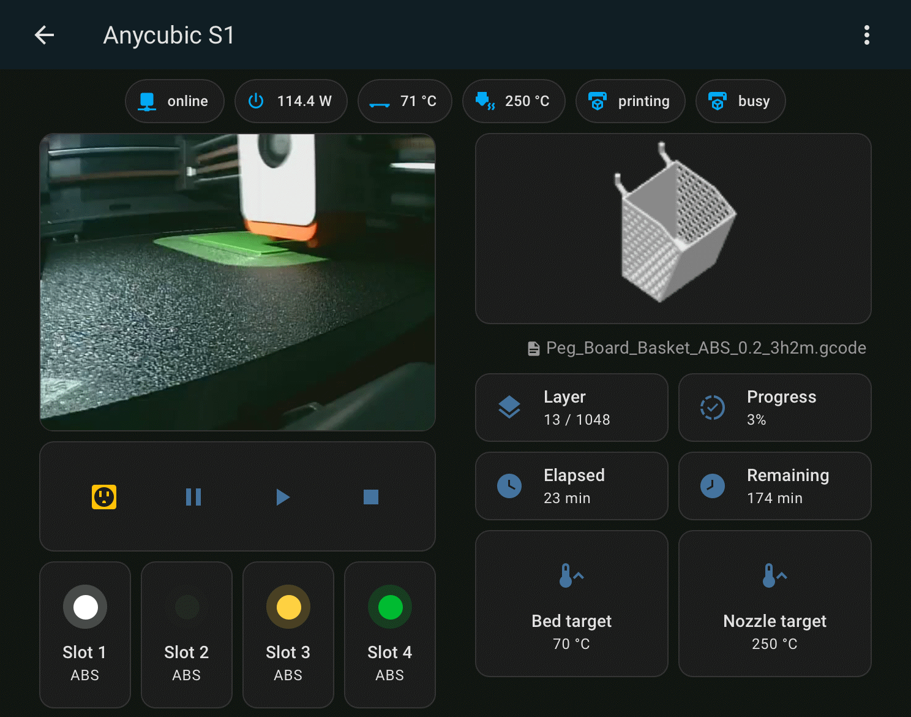

# Anycubic S1 MQTT Bridge

This project provides a bridge between Anycubic Kobra S1 3D printers and Home Assistant using MQTT. It allows for monitoring and controlling the printer through Home Assistant, enabling features such as printer status updates, light control, print pause/resume/cancel, and video streaming.

## Table of Contents

- [Installation](#installation)
- [Usage](#usage)
- [Configuration](#configuration)
- [Docker Setup](#docker-setup)
- [Contributing](#contributing)
- [License](#license)

## Installation

1. Clone the repository:

   ```
   git clone https://github.com/metheos/anycubic-s1-mqtt-bridge.git
   cd anycubic-s1-mqtt-bridge
   ```

2. Create a `.env` file based on the `.env.example` file and fill in the required environment variables.

3. Install the required Python packages:
   ```
   pip install -r requirements.txt
   ```

## Usage

To run the application, execute the following command:

```
python asm.py
```

Make sure your printer is connected and configured properly.

## Configuration

The application uses environment variables for configuration. You can set the following variables in your `.env` file:

- `ANYCUBIC_S1_IP`: Your S1 IP
- `HA_BROKER`: Your.HomeAssistant.MQTT.Address
- `HA_PORT`: 1883
- `HA_USER`: Your Home Assistant MQTT username.
- `HA_PASS`: Your Home Assistant MQTT password.
- `SNAPSHOT_INTERVAL_IDLE`: Interval for taking snapshots when printer is idle.
- `SNAPSHOT_INTERVAL_BUSY`: Interval for taking snapshots when printer is busy.
- `INFO_UPDATE_INTERVAL`: Interval for updating printer information.

## Docker Setup

To run the application using Docker, you can use the provided `Dockerfile` and `docker-compose.yml`.

1. Build the Docker image:

   ```
   docker-compose build
   ```

2. Start the application:
   ```
   docker-compose up
   ```

This will start the application in a Docker container, allowing for easy deployment and management.

## Home Assistant Integration

The repository includes an example Home Assistant view configuration that you can use to monitor your Anycubic printer:



To use this view:

1. Copy the content from the [home_assistant_view_example.yaml](home_assistant_view_example.yaml) file
2. Paste it into the view yaml editor and click **Save**

This view uses elements from https://github.com/piitaya/lovelace-mushroom for the AMS spool visualization.

You may need to adjust entity IDs to match the ones created by your specific printer.

## Contributing

Contributions are welcome! Please open an issue or submit a pull request for any improvements or bug fixes.
